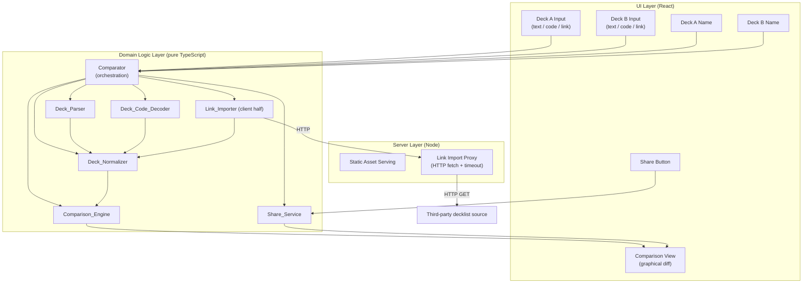

# Design Document

## Overview

The Riftbound Deck Comparator is a self-hosted web application that compares two Riftbound decks and renders their differences and commonalities graphically. Each deck is supplied through one of three input methods — a pasted text deck list, a Piltover Archive deck code, or a decklist URL — and the two decks may use different methods within a single comparison. Comparison is printing-independent: alternate art, signed, and base printings of the same card collapse to a single normalized identity before decks are diffed. Users can name each deck (or inherit a name from a source link) and generate a shareable link that reproduces the exact comparison.

This document describes the architecture, component contracts, data models, correctness properties, error handling, and testing strategy that satisfy the approved requirements. The design decomposes the system into the components named in the requirements glossary: **Comparator** (the overall application), **Deck_Parser**, **Deck_Code_Decoder**, **Link_Importer**, **Deck_Normalizer**, **Comparison_Engine**, and **Share_Service**.

### Key Design Decisions

- **Client-heavy architecture with a thin server.** Text parsing, deck-code decoding, normalization, comparison, and share-link generation are all pure, deterministic transformations over deck data. They live in a shared TypeScript library that runs primarily in the browser. The server exists mainly to (a) serve the static app and (b) proxy link imports, which require server-side HTTP fetches to reach third-party decklist sources without CORS restrictions and to enforce timeouts. This keeps the deployable surface small, which suits an LXC container on Proxmox.
- **Reuse the official deck-code library.** The `@piltoverarchive/riftbound-deck-codes` npm package is the reference implementation for encoding/decoding Piltover Archive deck codes. The Deck_Code_Decoder wraps this library rather than reimplementing the VarInt/base32 scheme. (Source: [RiftboundDeckCodes](https://github.com/Piltover-Archive/RiftboundDeckCodes). Content was rephrased for compliance with licensing restrictions.)
- **Share links are self-contained, not server-stored.** A shareable link encodes the full comparison state (both decks, both names) in the URL fragment. No database or persistence layer is required, which keeps the container stateless and eliminates data-retention concerns.
- **Normalization is the comparison boundary.** All three input paths converge on a common `StructuredDeck` shape (card code → quantity). Normalization then strips printing variants so the Comparison_Engine only ever operates on printing-independent identities.

### Technology Stack

| Concern | Choice | Rationale |
| --- | --- | --- |
| Language | TypeScript | The official deck-code library is TypeScript; a single language across client, server, and shared logic reduces duplication and enables the shared pure-logic library. |
| UI framework | React + Vite | Component model fits the two-deck side-by-side comparison view; Vite produces a static bundle that is trivial to serve. |
| Server runtime | Node.js (Fastify or Express) | Minimal HTTP server to serve static assets and expose a single link-import proxy endpoint; small footprint for the LXC container. |
| Deck codes | `@piltoverarchive/riftbound-deck-codes` | Reference implementation; avoids reimplementing the encoding scheme. |
| Testing | Vitest + fast-check | Vitest runs unit and property tests; fast-check is the property-based testing library for TypeScript. |
| Deployment | Single Node process in an LXC container | Stateless, no external services; the process serves the built static bundle and the proxy endpoint behind a reverse proxy if desired. |

## Architecture

The system is organized into three layers: a **UI layer** (React), a **domain logic layer** (pure TypeScript, shared and runnable in the browser), and a **server layer** (Node) whose only non-static responsibility is the link-import proxy.



### Data Flow

1. The user selects an input method for each deck and provides input (text, deck code, or URL) plus an optional name.
2. On "Compare", the **Comparator** routes each deck's raw input to the appropriate producer — **Deck_Parser** (text), **Deck_Code_Decoder** (deck code), or **Link_Importer** (URL) — obtaining a `StructuredDeck` (and, for links, an optional source name).
3. Each `StructuredDeck` is passed through the **Deck_Normalizer**, collapsing printing variants and summing quantities into a `NormalizedDeck`.
4. The **Comparison_Engine** diffs the two `NormalizedDeck`s into a `ComparisonResult` of Shared Cards and Card Differences.
5. The UI renders the `ComparisonResult` graphically, resolving each deck's display name per the naming rules.
6. On "Share", the **Share_Service** encodes both decks, both names, into a `ShareableLink`; opening the link reverses the process and re-runs the comparison.

### Deck Name Resolution

Name resolution is a distinct concern that the Comparator applies when constructing each deck's display name. The precedence is:

1. A user-entered name with at least one non-whitespace character (trimmed) wins over any source name.
2. Otherwise, a source name from a link (truncated to 100 characters) is used.
3. Otherwise, the default `Deck 1` / `Deck 2` is assigned by position.

Names longer than 100 characters submitted by the user are rejected, and the prior name is retained.

## Components and Interfaces

All domain components are pure functions or classes with no I/O except the Link_Importer's server half. Producers return a discriminated result (`Ok` / `Err`) rather than throwing, so the Comparator can attribute errors to the correct deck and input method.

### Shared Result Type

```typescript
type Result<T, E = DeckError> =
  | { ok: true; value: T }
  | { ok: false; error: E };

interface DeckError {
  code: string;        // machine-readable, e.g. "PARSE_LINE", "INVALID_CODE"
  message: string;     // human-readable message
  deck?: "first" | "second"; // which deck the error belongs to, when applicable
  inputMethod?: InputMethod; // which method produced the error, when applicable
  lineNumber?: number; // for text parse errors
  lineContent?: string;
}
```

### Comparator

Orchestrates the full flow and owns cross-cutting concerns: input-method routing, missing-input detection, name resolution, and error attribution.

```typescript
type InputMethod = "text" | "code" | "link";

interface DeckInput {
  method: InputMethod;
  raw: string;          // pasted text, deck code, or URL
  userName?: string;    // optional user-entered name
}

interface CompareRequest {
  first: DeckInput;
  second: DeckInput;
}

interface Comparator {
  // Validates presence, routes each deck to its producer, normalizes,
  // compares, and resolves names. Returns a full comparison or the first
  // blocking error, attributed to a deck and method. (Reqs 1, 6, 8)
  compare(request: CompareRequest): Promise<Result<ComparisonView>>;
}

interface ComparisonView {
  firstName: string;
  secondName: string;
  result: ComparisonResult;
}
```

- Rejects with a missing-input error identifying the deck when either deck has empty input (Req 1.6).
- Rejects with a format error identifying the method and reason when a producer fails (Req 1.7).
- Allows the two decks to use different input methods (Req 1.5).

### Deck_Parser

Parses and formats text deck lists. Pure; no I/O.

```typescript
interface DeckParser {
  // Parses a text deck list into a StructuredDeck. (Reqs 2.1–2.5)
  parse(text: string): Result<StructuredDeck>;

  // Formats a StructuredDeck into canonical text, one "<qty> <CardCode>"
  // line per card code. (Req 2.6)
  format(deck: StructuredDeck): string;
}
```

Parsing rules:
- Each non-blank line matches `"<quantity> <CardCode>"` or `"<quantity>x <CardName>"`, where quantity is an integer 1–99 and a card code matches `SET-[prefix]number[variant]` (Req 2.2).
- Lines referencing the same card code sum, capped at 99 (Req 2.3).
- Blank/whitespace-only lines are ignored; zero-quantity cards are excluded (Req 2.4).
- Any malformed line rejects the whole submission with the failing line number and content (Req 2.5).
- `parse → format → parse` is equivalent to the first parse (Req 2.7).

### Deck_Code_Decoder

Wraps `@piltoverarchive/riftbound-deck-codes`. Decodes/encodes Piltover Archive deck codes.

```typescript
interface DeckCodeDecoder {
  // Decodes a deck code into a StructuredDeck (main deck cards). (Reqs 3.1, 3.2)
  decode(code: string): Result<StructuredDeck>;

  // Encodes a StructuredDeck into a deck code. (Req 3.3)
  encode(deck: StructuredDeck): Result<string>;
}
```

- `decode` calls `getDeckFromCode(code)` and maps `mainDeck` entries (`{ cardCode, count }`) into a `StructuredDeck`; invalid/empty/malformed codes produce an invalid-code error rather than throwing (Req 3.2).
- `encode` calls `getCodeFromDeck(mainDeck)`; the library requires positive integer counts and throws otherwise, which is caught and returned as an error (Req 3.3).
- The library normalizes signed suffixes to `s` and `SP` numbers to unpadded form on decode, so the round-trip property is defined over the library's canonical form (see Correctness Properties and Error Handling).

### Link_Importer

Retrieves a decklist from a URL. Split across the client (issues the request, applies the 30s timeout from the caller's perspective) and the server proxy (performs the outbound HTTP GET, enforces the timeout, and scrapes/parses the source).

```typescript
interface ImportedDeck {
  deck: StructuredDeck;
  sourceName?: string; // present only if the source provides a deck name
}

interface LinkImporter {
  // Retrieves and parses a decklist from a supported URL. (Reqs 4.1–4.7)
  import(url: string): Promise<Result<ImportedDeck>>;
}
```

- Rejects URLs that are not well-formed or reference an unsupported source, with an unsupported-source error (Req 4.2).
- Aborts and errors if retrieval exceeds 30 seconds (Req 4.3).
- Errors on any retrieval failure without producing a deck (Req 4.4).
- Treats "retrieved content cannot be parsed into at least one card with quantity ≥ 1" as a retrieval failure (Req 4.5).
- Extracts and attaches the source deck name when present; attaches none when absent (Reqs 4.6, 4.7).

Supported sources are defined by a registry of source adapters, each exposing a URL matcher and a parser from raw source content to `ImportedDeck`.

### Deck_Normalizer

Reduces card identity to a printing-independent form.

```typescript
interface DeckNormalizer {
  // Strips variant suffixes, retains set + full card number (incl. R/SP
  // prefix), and sums quantities across printings. (Reqs 5.1–5.5)
  normalize(deck: StructuredDeck): Result<NormalizedDeck>;
}
```

- Produces a `NormalizedCardIdentity` (set + number, prefix retained, variant removed) for each card code (Reqs 5.1, 5.2).
- Two codes sharing set + number are the same identity regardless of variant (Req 5.3).
- Quantities of multiple printings of the same identity are summed (Req 5.4).
- A card code not matching `SET-[prefix]number[variant]` rejects the deck with a malformed-code error (Req 5.5).

### Comparison_Engine

Diffs two normalized decks.

```typescript
interface ComparisonEngine {
  // Computes per-identity quantities for both decks, classifies shared vs.
  // different, and is symmetric in deck order. (Reqs 6.1–6.7)
  compare(first: NormalizedDeck, second: NormalizedDeck): ComparisonResult;
}
```

- For each identity in either deck, records the first-deck and second-deck quantities from actual contents (Req 6.1).
- Classifies as Shared when quantities are equal, Card Difference when they differ (Req 6.2).
- An identity in only one deck is a Card Difference with quantity 0 for the absent deck (Req 6.3).
- Identical decks after normalization report zero Card Differences (Req 6.4).
- The set of Shared Cards and set of Card Differences is identical regardless of deck order, with per-deck quantities attributed correctly (Req 6.5).
- Empty decks are handled: every identity in the non-empty deck becomes a Card Difference with 0 for the empty deck (Req 6.7).

### Share_Service

Creates and resolves self-contained shareable links.

```typescript
interface SharePayload {
  first: StructuredDeck;
  second: StructuredDeck;
  firstName: string;
  secondName: string;
}

interface ShareService {
  // Encodes the full comparison state into a shareable link. (Req 9.1)
  createLink(payload: SharePayload): string;

  // Reconstructs the payload from a link; errors if malformed. (Reqs 9.2, 9.4)
  resolveLink(url: string): Result<SharePayload>;
}
```

- Encodes both decks' card codes and quantities, both names, and (derivably) the comparison result into the link (Req 9.1). The comparison result is deterministic from the two decks, so the link stores the decks and recomputes the result on open, guaranteeing consistency.
- Reconstructs both decks and both names verbatim, preserving the full character sequence of each name (Req 9.2).
- `createLink → resolveLink → compare` reproduces the same per-deck quantities, classifications, and names (Req 9.3).
- Malformed links or unreconstructable contents produce an invalid-link error with no partial comparison (Req 9.4).

## Data Models

### Card Code and Normalized Identity

A **Card Code** is the raw identifier `SET-[prefix]number[variant]`.

```typescript
// Structural breakdown of a card code, e.g. "VEN-SP1a":
interface CardCodeParts {
  set: string;            // "VEN" (three-character set id)
  numberPrefix: "" | "R" | "SP"; // "SP"
  number: string;         // "1" (digits; may be zero-padded for base/R)
  variant: string;        // "a" (single char, or "" for base)
}
```

The card code grammar (used by Deck_Parser and Deck_Normalizer):

```
cardCode   := set "-" numberPrefix number variant?
set        := [A-Z]{3}
numberPrefix := "" | "R" | "SP"
number     := [0-9]+
variant    := [a-z*]        // e.g. a, b, s, *  (base has no variant)
```

A **Normalized Card Identity** is the card code with the variant removed and set + prefixed number retained. It is represented canonically as a string key `SET-[prefix]number` (e.g. `OGN-007`, `VEN-SP1`, `RAD-R05`) so it can serve directly as a map key.

Set identifiers recognized (from the deck-code specification): `OGN`, `OGS`, `ARC`, `SFD`, `UNL`, `VEN`, `RAD`.

### StructuredDeck

The common shape produced by all three input paths. A map from card code (with variant, as supplied) to total quantity.

```typescript
// Card code -> quantity (1..99 for text; 1+ for decoded codes)
type StructuredDeck = Map<string, number>;
```

Invariants:
- All quantities are integers ≥ 1 (zero-quantity entries are excluded).
- Text-sourced decks cap each card code at 99.

### NormalizedDeck

```typescript
// NormalizedCardIdentity key -> summed quantity
type NormalizedDeck = Map<string, number>;
```

Invariant: all quantities are integers ≥ 1, keyed by `SET-[prefix]number`.

### ComparisonResult

```typescript
interface CardEntry {
  identity: string;   // normalized identity key "SET-[prefix]number"
  firstQuantity: number;  // 0 if absent from the first deck
  secondQuantity: number; // 0 if absent from the second deck
}

interface ComparisonResult {
  shared: CardEntry[];       // firstQuantity === secondQuantity (both > 0)
  differences: CardEntry[];  // firstQuantity !== secondQuantity
}
```

### Deck Name

A resolved deck name is a string of 1–100 characters. Resolution inputs are the user-entered name (optional), the source name (optional), and the deck position (first/second) for the default.

### ShareableLink Encoding

The link stores a `SharePayload` in the URL fragment (`#...`) so it never reaches the server. The payload is serialized to JSON, then compressed and base64url-encoded to keep links compact and URL-safe:

```
https://<host>/#c=<base64url(compress(JSON.stringify(payload)))>
```

Using the fragment keeps the potentially large deck data out of server logs and request lines and avoids server storage entirely.

## Correctness Properties

*A property is a characteristic or behavior that should hold true across all valid executions of a system — essentially, a formal statement about what the system should do. Properties serve as the bridge between human-readable specifications and machine-verifiable correctness guarantees.*

The core domain logic of this feature — text parsing, deck-code decoding, normalization, comparison, and share-link encoding — consists of pure, deterministic transformations over deck data. This makes it well suited to property-based testing, especially the round-trip and invariant patterns. The properties below were derived from the acceptance-criteria prework and consolidated to remove redundancy so each provides unique validation value.

### Property 1: Text parse/format round trip

*For any* parseable Deck List (Text), parsing it, formatting the resulting structured deck back to text, and parsing that text again produces a structured deck equivalent to the first parse — the same set of Card Codes each mapped to the same quantities.

**Validates: Requirements 2.1, 2.2, 2.6, 2.7**

### Property 2: Duplicate quantities sum and cap at 99

*For any* Deck List (Text) containing multiple lines that reference the same Card Code, the parsed structured deck maps that Card Code to the minimum of 99 and the sum of those lines' quantities.

**Validates: Requirements 2.3**

### Property 3: Blank and whitespace lines are ignored and no zero entries

*For any* parseable Deck List (Text), inserting any number of blank or whitespace-only lines at arbitrary positions produces a parsed structured deck identical to parsing the original, and the resulting structured deck never contains an entry with quantity zero.

**Validates: Requirements 2.4**

### Property 4: Deck code canonical round trip

*For any* structured deck the Deck_Code_Decoder can encode (valid Card Codes with positive integer counts), decoding then encoding then decoding produces a structured deck equivalent to decoding the first encoding — the same set of Card Codes each mapped to the same quantities — where equivalence is taken over the deck-code library's canonical form (signed variants normalized to `s`, `SP` numbers unpadded).

**Validates: Requirements 3.1, 3.3, 3.4**

### Property 5: Normalized identity is variant-independent

*For any* Card Code, its Normalized Card Identity equals the set identifier plus the full card number (including any `R` or `SP` prefix) with the variant suffix removed; consequently, any two Card Codes that share the same set and number normalize to the same identity regardless of their variant suffixes, and a base printing (no variant) normalizes to itself unchanged.

**Validates: Requirements 5.1, 5.2, 5.3**

### Property 6: Normalization sums quantities across printings

*For any* structured deck, the normalized quantity for each Normalized Card Identity equals the sum of the quantities of every Card Code in the deck that reduces to that identity.

**Validates: Requirements 5.4**

### Property 7: Comparison correctness

*For any* pair of normalized decks, the comparison result records, for every Normalized Card Identity present in either deck, that deck's actual quantity in each deck (zero where absent), and classifies the identity as a Shared Card exactly when the two per-deck quantities are equal and as a Card Difference exactly when they differ; every identity present in either deck appears in exactly one of the two result sets.

**Validates: Requirements 6.1, 6.2, 6.3, 6.7**

### Property 8: Comparison is order-symmetric

*For any* pair of normalized decks A and B, comparing (A, B) and comparing (B, A) yield the same set of Shared Card identities and the same set of Card Difference identities, with each entry's first-deck and second-deck quantities swapped between the two results.

**Validates: Requirements 6.5**

### Property 9: Comparing a deck with itself yields zero differences

*For any* normalized deck, comparing it against itself produces a comparison result containing zero Card Differences.

**Validates: Requirements 6.4**

### Property 10: Name resolution precedence

*For any* combination of an optional user-entered name, an optional source name, and a deck position, the resolved deck name is: the trimmed user-entered name when it contains at least one non-whitespace character; otherwise the source name truncated to 100 characters when a source name is present; otherwise the position default (`Deck 1` for the first deck, `Deck 2` for the second).

**Validates: Requirements 8.2, 8.3, 8.4**

### Property 11: Graphical view includes all differences with full detail

*For any* comparison result, the rendered graphical view contains, for every Card Difference, its Normalized Card Identity and both its first-deck and second-deck quantities each attributed to the correct deck, and also displays both deck names.

**Validates: Requirements 7.1, 7.3, 7.4, 7.5**

### Property 12: Share link round trip

*For any* comparison state (two structured decks and two deck names), generating a Shareable Link and then resolving it reconstructs both decks and both names — with each name preserved verbatim including its full character sequence — such that recomputing the comparison from the resolved state reproduces the same per-deck quantities and the same Shared/Difference classification for every Normalized Card Identity as the original comparison.

**Validates: Requirements 9.1, 9.2, 9.3**

## Error Handling

Errors are represented as `Result` values (`{ ok: false, error: DeckError }`) rather than thrown exceptions across the domain layer, so the Comparator can attribute each error to a specific deck and input method and present a precise message. The only place exceptions are expected is at the boundary with the deck-code library and the network, and those are caught and converted to `DeckError`.

| Scenario | Requirement | Handling |
| --- | --- | --- |
| Deck has no input | 1.6 | Comparator returns a missing-input error naming the deck (`first`/`second`). |
| Input does not match selected method | 1.7 | Producer returns an error identifying the method and the reason; Comparator attributes it to the deck. |
| Text line fails to parse | 2.5 | Deck_Parser returns an error with the failing line number and content; no structured deck is produced. |
| Empty/malformed/undecodable deck code | 3.2 | Deck_Code_Decoder catches library errors and returns an invalid-code error; never throws. |
| Encode called with invalid counts | 3.3 | Library throws on non-positive/non-integer counts; wrapper catches and returns an error. |
| Malformed or unsupported URL | 4.2 | Link_Importer returns an unsupported-source error. |
| Retrieval exceeds 30 seconds | 4.3 | Proxy aborts the fetch; Importer returns a retrieval-failure error. |
| Retrieval fails (network, HTTP error) | 4.4 | Importer returns a retrieval-failure error; no deck. |
| Retrieved content has no parseable cards | 4.5 | Treated as a retrieval failure; retrieval-failure error returned. |
| Malformed Card Code during normalization | 5.5 | Deck_Normalizer returns an error naming the malformed code; the deck is rejected. |
| Missing/unnormalizable deck at comparison | 6.6 | Comparator returns an error indicating a valid normalized deck is missing; no result. |
| User name exceeds 100 characters | 8.5 | Comparator rejects the name with a max-length message and retains the prior name. |
| Malformed or unreconstructable share link | 9.4 | Share_Service returns an invalid-link error; no partial or altered comparison is displayed. |

The Link_Importer's 30-second timeout is enforced server-side on the proxy using an abortable fetch, so a slow or hanging third-party source cannot hold the request open indefinitely.

## Testing Strategy

The feature uses a dual testing approach: **property-based tests** verify the universal properties above across many generated inputs, and **example, edge-case, and integration tests** cover specific scenarios, boundaries, error conditions, and the network-dependent link import.

### Property-Based Tests

- Library: **fast-check** (property-based testing for TypeScript), run under **Vitest**. Property-based testing is not implemented from scratch.
- Each property test runs a **minimum of 100 iterations**.
- Each property test is tagged with a comment referencing its design property, using the format: `Feature: riftbound-deck-comparator, Property {number}: {property_text}`.
- Each of Properties 1–12 is implemented by a **single** property-based test.

Generators:
- **Card code generator**: produces valid codes `SET-[prefix]number[variant]` drawing sets from `{OGN, OGS, ARC, SFD, UNL, VEN, RAD}`, prefixes from `{"", R, SP}`, numbers as digit strings, and variants from `{"", a, b, s, *}`. This generator drives normalization, comparison, and deck-code round-trip properties, and its edge cases cover special/rune numbers and signed-variant equivalence.
- **Structured deck generator**: maps of card codes to quantities, with variants that intentionally collapse to the same identity (to exercise Properties 5 and 6) and quantities spanning the 1–99 range (with over-99 sums to exercise Property 2's cap). Includes the **empty deck** to cover Requirement 6.7 within Property 7.
- **Deck-list text generator**: emits both accepted line forms (`"<qty> <CardCode>"` and `"<qty>x <CardName>"`), duplicate lines, and interleaved blank/whitespace lines for Properties 1–3.
- **Malformed-input generators**: invalid lines, garbage deck-code strings, malformed URLs, over-length names, and corrupted share links for the edge-case tests below.

Property-to-test mapping:

| Property | Component under test |
| --- | --- |
| P1 Text parse/format round trip | Deck_Parser |
| P2 Duplicate sum and cap | Deck_Parser |
| P3 Whitespace-invariant, no zero entries | Deck_Parser |
| P4 Deck code canonical round trip | Deck_Code_Decoder |
| P5 Variant-independent identity | Deck_Normalizer |
| P6 Sum across printings | Deck_Normalizer |
| P7 Comparison correctness | Comparison_Engine |
| P8 Order symmetry | Comparison_Engine |
| P9 Self-comparison zero differences | Comparison_Engine |
| P10 Name resolution precedence | Comparator (name resolution) |
| P11 View includes all differences | Comparison view renderer |
| P12 Share link round trip | Share_Service |

### Unit and Edge-Case Tests

Focused example and boundary tests (not property tests), kept minimal since properties cover broad input ranges:

- **Input routing (1.1–1.5)**: accepts two decks; each method works; a mixed-method comparison succeeds.
- **Missing input (1.6)** and **format mismatch (1.7)**: one/both decks empty; input that does not match the chosen method.
- **Parse rejection (2.5)**: a single malformed line at a known position reports its line number and content.
- **Invalid deck code (3.2)**: empty and garbage codes return invalid-code errors without throwing.
- **Malformed card code in normalization (5.5)**: a deck with one bad code is rejected, naming the code.
- **Missing normalized deck (6.6)**: comparison with an unavailable deck returns the missing-deck error.
- **Name boundaries (8.1, 8.5)**: names of length 1 and 100 are accepted; length 101 is rejected and the prior name retained.
- **Rendering examples (7.2, 7.6)**: differences render with a distinguishing indicator vs. shared cards; a zero-difference result shows the no-differences indication.
- **Invalid share link (9.4)**: corrupted link strings return an invalid-link error with no partial comparison.

### Integration Tests (Link Import)

The Link_Importer depends on external HTTP retrieval, so it is covered by integration tests with mocked source adapters rather than property tests:

- **Successful import (4.1)**: a mocked source returns known content; assert the structured deck is produced.
- **Source name present/absent (4.6, 4.7)**: mocked content with and without a deck name; assert `sourceName` is set or undefined accordingly.
- **Timeout (4.3)**: a mocked slow source triggers the 30-second abort and a retrieval-failure error.
- **Retrieval failure (4.4)** and **unparseable content (4.5)**: mocked failure and mocked content with no cards both yield retrieval-failure errors and no deck.
- **Unsupported source (4.2)**: malformed and unsupported-domain URLs return unsupported-source errors.

### Why Property-Based Testing Applies Here

The parser, deck-code decoder, normalizer, comparison engine, and share service are pure functions with large input spaces and clear round-trip and invariant relationships — the ideal case for PBT. Parsers and serializers in particular are validated with round-trip properties (Properties 1, 4, and 12). The link import layer, by contrast, is I/O-bound and its behavior does not vary meaningfully across generated inputs, so it is verified with integration tests instead.
